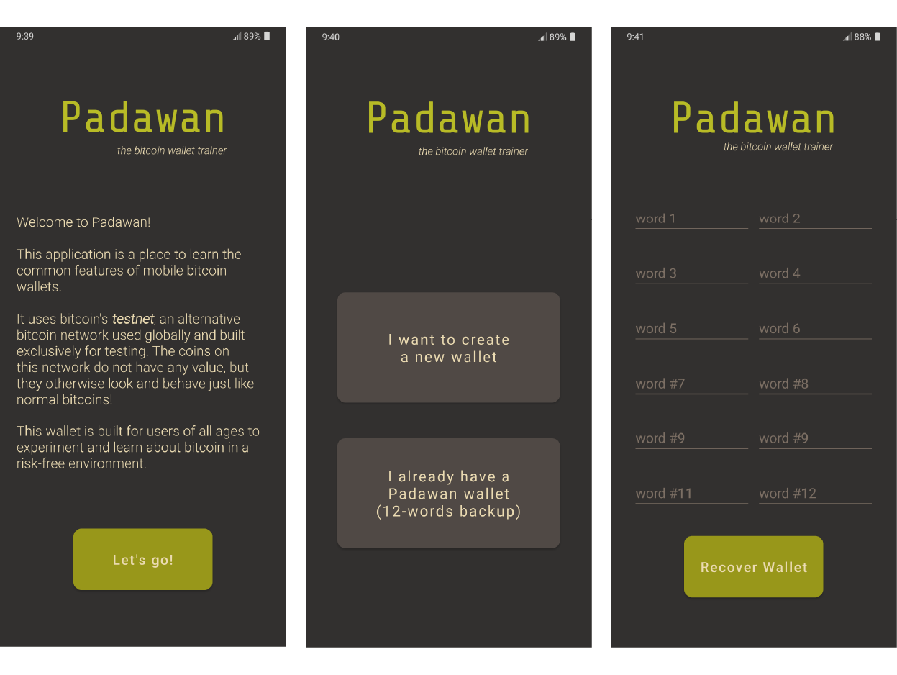
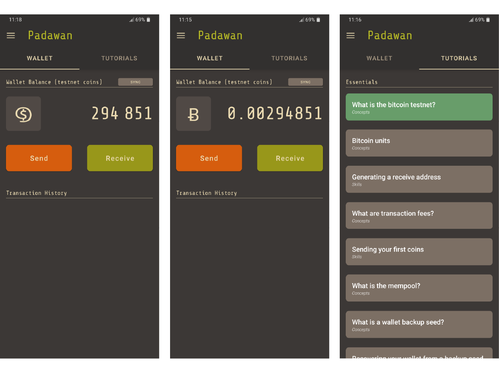
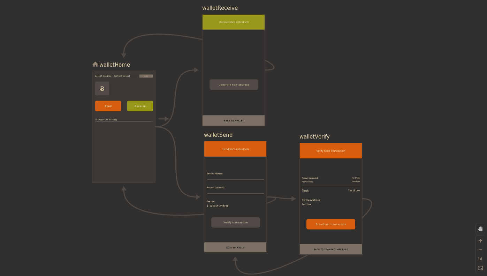

  <h1>Padawan Wallet</h1>
   
   
  

 
 

 
 
 
 
 

A testnet-only bitcoin wallet full of tutorials on how to use bitcoin wallets.

We're building the app you'll want to recommend to your teenage cousins at Christmas or to your dad that keeps asking questions about bitcoin. It aims to be a self-study tool, getting its users acquainted with the usual workflow and basic jargon of mobile wallets in a risk-free environment perfect for experimentation and learning (testnet).

We think testnet is an underused resource outside of software development circles, and believe it can be leveraged for bitcoin-curious people everywhere. Testnet offers all the complexity of mainnet, and one of the goal of this wallet is to eventually foray into these more advanced bitcoin features (output descriptors, multisig wallets, DLCs) and offer a training and testing ground for users.

Join us on [discord](https://discord.gg/qTysDfZ2gX)!  
 

## Download

You can download the latest apk for this app on the [`v0.7.0` release page](https://github.com/thunderbiscuit/padawan-wallet/releases/tag/v0.7.0).  
 

## Screenshots

  
  
  

 

## FAQ
### 🧐 Tutorials you say?
The tutorials are broken down in two groups: _Essentials_ and _Advanced_, each of which contain _Concepts to understand_ and _Skills to master_. The currently planned tutorials are the following:

**Essentials**
1. What is the bitcoin testnet? (concept)  
2. Bitcoin units (concept)
3. Receiving bitcoin (skill)
4. What is the mempool? (concept)
5. Sending bitcoin (skill)
6. What are transaction fees? (concept)
7. What is a wallet backup seed? (concept)
8. Recovering a wallet from a backup seed (skill)  

**Advanced**  
1. Connect to your own node  
2. Replace-by-fee  
3. Address types  
4. What are light clients?  

### 🧐 Where can I get testnet coins?
There are many bitcoin testnet faucets out there, but Padawan uses native segwit addresses uniquely (bech32), so you'll need a faucet that can send to those. We suggest [this one](https://testnet-faucet.mempool.co/).

### Building and Running Padawan
To accomplish the two tasks above you will need:

- Android Studio
- A phone with Android 6 OS or above (Android Marshmallow, API level 23) with USB debugging activated OR an emulator on your development machine
- The bitcoindevkit library

#### **Bitcoindevkit library**
The bitcoindevkit library for Android bdk-jni is not yet available on public repositories of Android libraries. This means that in order to acquire it, one must either (a) build it from source, or (b) find a pre-built version provided elsewhere.

#### To build it from source
Head to https://github.com/bitcoindevkit/bdk-jni
- Run `rustup target add x86_64-apple-darwin x86_64-unknown-linux-gnu x86_64-linux-android aarch64-linux-android armv7-linux-androideabi i686-linux-android`
- `export ANDROID_NDK_HOME=/home/<user>/Android/Sdk/ndk/<NDK version, ie. 21.4.7075529>`
- `./gradlew build`
- `export ANDROID_SDK_ROOT=</home/<user>/Android/Sdk or where ever your Sdk is installed>`
- `./gradlew publishToMavenLocal`

For details have a look on the bdk-jni [readme](https://github.com/bitcoindevkit/bdk-jni#readme)

If you have a prebuilt downloaded library, you'll need to copy it in a place called your local maven repository, located at ~/.m2/repository (create it if it doesn't exist). (~/.m2/repository/org/bitcoindevkit/bdkjni/bdk)

Once you are done with above steps load the project in android studio, build and run it!!!

### 🧐 How can I contribute?
If you think this project is interesting and would like to contribute, get access to the early release on the app store, or simply provide feedback and bounce ideas, check out [our discord group](https://discord.gg/qTysDfZ2gX). Users and devs welcome.
