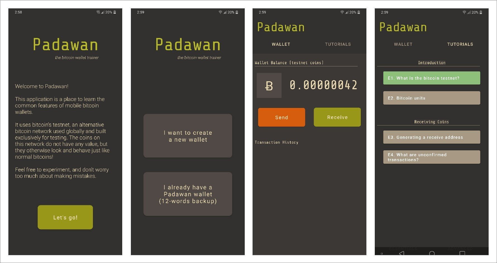

  <h1>Padawan Wallet</h1>
  

 

 

A testnet-only wallet full of tutorials on how to use bitcoin wallets.

This is the wallet app you'd want to recommend to your teenage cousins at Christmas or your dad that keeps asking questions about bitcoin. It's hopefully a self-study tool, getting its users acquainted with the usual workflow and basic jargon of mobile wallets, in an environment where mistakes don't matter too much (testnet only).

 

  

 

## Planned Tutorials
The tutorials are broken down in two groups: _Essentials_ and _Advanced_. The currently planned tutorials are the following:

#### Essentials
- [ ] What is the bitcoin testnet?  
- [ ] Bitcoin units  
- [ ] Generating a receive address  
- [ ] What are unconfirmed transactions?  
- [ ] What is the mempool?  
- [ ] Sending your first coins  
- [ ] What are transaction fees?  
- [ ] What is a wallet backup seed?  

#### Advanced
- [ ] Connect to your own node  
- [ ] Replace-by-fee  
- [ ] Address types  
- [ ] What are light clients?  
