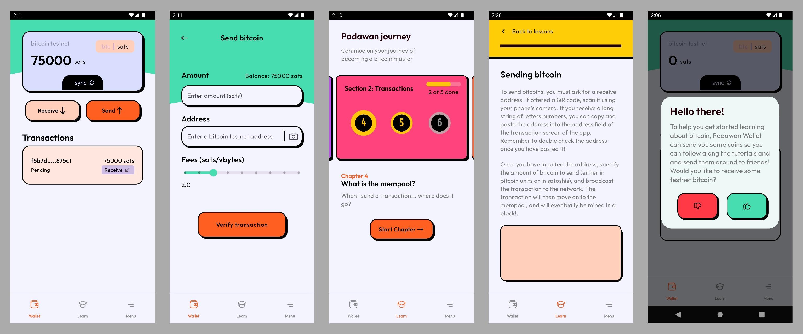

  <h1>Padawan Wallet</h1>
   
   
  

 
 

 
 
 

Padawan is a testnet-only bitcoin wallet that will teach you how to use... bitcoin wallets! Padawan aims to be a self-study tool, getting its users acquainted with the usual workflow and basic jargon of mobile wallets in a risk-free environment perfect for experimentation and learning (testnet).

We think testnet is an underused resource outside of software development circles, and believe it can be leveraged for bitcoin-curious people everywhere. Testnet offers most of the complexity of mainnet at no risk! Practice your wallet skills, learn about transaction fees, mempools, and recovery phrases, all without the pressure of handling mainnet bitcoins! Perfect for people of all ages, it's completely free and will send you testnet satoshis to play with right from the get go.
 

## Download
You can download the latest APK for this app on the [`v0.12.0: Daring Droid` release page](https://github.com/thunderbiscuit/padawan-wallet/releases/tag/v0.12.0) or find it on the [Google Play Store](https://play.google.com/store/apps/details?id=com.goldenraven.padawanwallet).

 

## Screenshots

  

 

## FAQ
### Tutorials you say?
There are currently 9 tutorials in the app:
1. What is the Bitcoin testnet?  
2. Receiving bitcoin
3. Sending bitcoin
4. What is the mempool?
5. What are transaction fees?
6. Bitcoin units
7. What is a recovery phrase?
8. Recovering your wallet
9. The different types of wallets

### Where can I get testnet coins?
Padawan sends you a 1-time amount of 75,000 satoshis (0.00075000 bitcoin) on startup so you can have fun right out of the gate. But if you need more testnet coins, there are many faucets out there. We suggest these two:
1. https://coinfaucet.eu/en/btc-testnet/
2. https://bitcoinfaucet.uo1.net/

### Building and running Padawan
To build and run the app from source, you'll need:
- Android Studio
- A phone with Android 8 (Android Oreo, API level 26) or above with USB debugging activated OR an emulator on your development machine.

### How can I contribute?
If you think this project is interesting and would like to contribute or simply provide feedback and bounce ideas, open an issue on this repository, or message the [@padawanwallet](https://twitter.com/padawanwallet) Twitter account!
